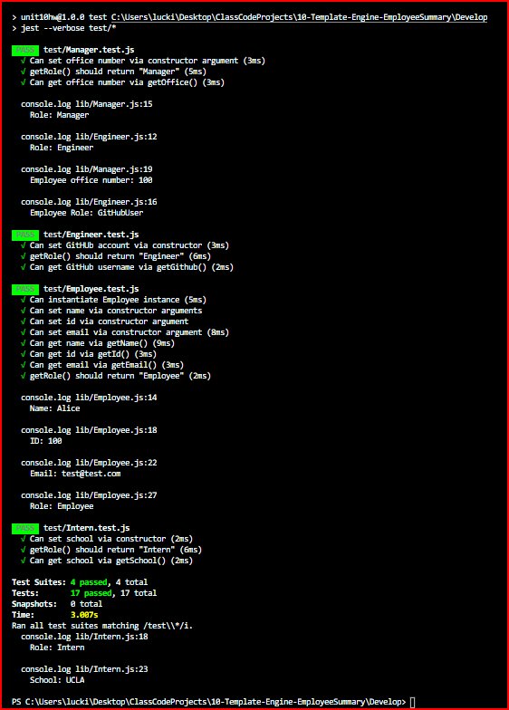
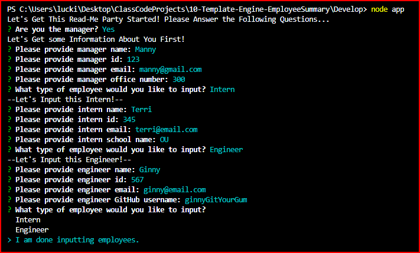
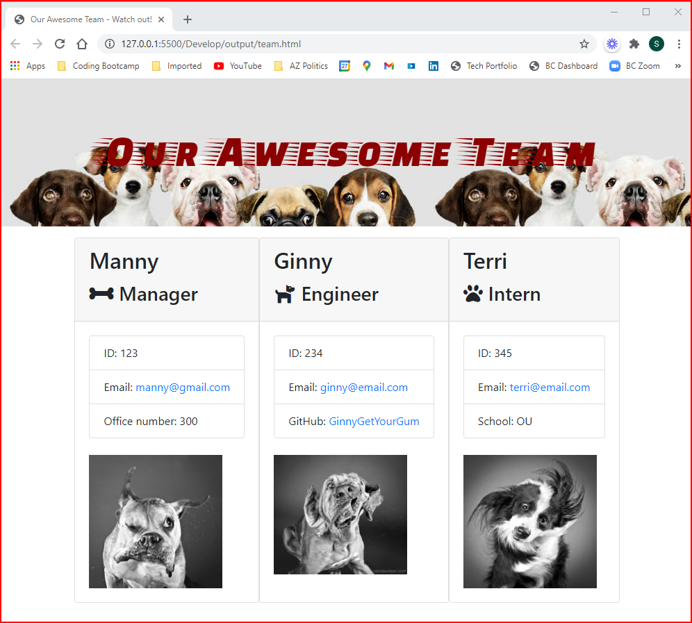

# Skye Lucking - 10 Employee Roster Template Engine

<h1>Description of application</h1>
This software is an "engineering team generator" command line application. The application will prompt the user for information about the team manager and then information about the team members. The user can input any number of team members, and they may be a mix of engineers and interns. This application also passes all unit tests. When the user has completed building the team, the application will create an HTML file that displays a nicely formatted team roster based on the information provided by the user with adorable squishy dog faces as an added bonus. You're welcome.  

 
 Enjoy!

 

<h1>Screenshots</h1>
Passed Tests - a Thing o' Beauty 
 
All tests passed!

Command Line Prompts for Team Information:  

Now it's time to meet the team!
 

<h1>Link to a video of the CLI Application Being Run</h1>
<a href="https://www.loom.com/share/00e1802120cd4840963dee3cf6af0954">Skye Lucking - Unit 10 OOP Homework: Template Engine - Employee Summary — Watch Video</a>

<h1>Link to GitHub Repo</h1>
<a href="https://github.com/skyelucking/10-Template-Engine-EmployeeSummary">https://github.com/skyelucking/10-Template-Engine-EmployeeSummary</a>

<h1>Now here is your joke...</h1>  
Q: What side of the dog has the most fur? 

 
 
 
<em>– A: The Outside.</em>
